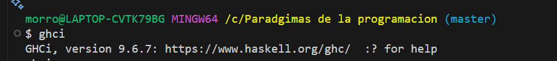

+++
date = '2025-11-27T13:14:57-08:00'
draft = false
title = 'Practica3: el paradigma funcional'
+++

# Reporte Practica 3

**Autor:** Daniel Mojica Salgado

**Fecha:** 07 de Septiembre de 2025

## Introducción

Haskell es un lenguaje de programación funcional puro, fuertemente tipado y orientado a la inmutabilidad. A diferencia de lenguajes imperativos como C, en Haskell no se modifica el estado directamente, sino que los programas se estructuran mediante funciones puras que reciben datos y producen nuevos valores.
El objetivo de este reporte es documentar la instalación del entorno de Haskell mediante GHCup, verificar que las herramientas funcionen correctamente y analizar el funcionamiento de la aplicación “TODO” incluida en el ejemplo oficial.

## ¿Qué es Haskell?

Haskell es un lenguaje de propósito general creado a finales de los años 80 para investigar la programación funcional. Se caracteriza por:

* Evaluación perezosa (lazy evaluation)
* Tipos fuertes y estáticos
* Funciones puras e inmutabilidad
* Alto nivel de abstracción

Su sintaxis es concisa y su modelo funcional obliga a pensar los problemas de forma declarativa, sin instrucciones secuenciales como ocurre en C.

## Ventajas y desventajas de Haskell

### Ventajas

* **Inmutabilidad:** evita errores por modificación accidental del estado.
* **Funciones puras:** facilitan pruebas, razonamiento matemático y paralelismo.
* **Tipado fuerte:** los errores se detectan antes de tiempo.
* **Sintaxis concisa:** menos código repetitivo.
* **Excelente para trabajo académico, procesamiento de datos y concurrencia.**

### Desventajas

* **Curva de aprendizaje pronunciada**, especialmente para quien viene de lenguajes imperativos.
* **Ecosistema más pequeño** comparado con Python, Java o C++.
* **Debugging menos intuitivo** debido a la evaluación perezosa.
* **No es el lenguaje más usado en la industria**, aunque es muy apreciado en áreas de investigación y sistemas críticos.

## Instalación del entorno de Haskell

Para instalar Haskell se siguieron las recomendaciones oficiales de la sección Downloads, donde se indica el uso de **GHCup.**

### Instalación con GHCup

1. Entrar a la página Downloads de Haskell.
1. Dar clic en el enlace GHCup.
1. Copiar el comando de instalación para Windows.
1. Abrir PowerShell (sin modo administrador).
1. Pegar y ejecutar el comando.
1. GHCup descargó automáticamente:
   * GHCup – gestor del ecosistema\
   * GHC – compilador
   * Hugs – intérprete interactivo
   * HLS – servidor de lenguaje
   * Stack – manejador de paquetes
   * Cabal – herramienta de construcción

Todos los archivos fuente terminan con la extensión **.hs**.

### Verificación de la instalación

Después de instalar, se ejecutaron los siguientes comandos para confirmar la instalación:

* **ghc --version**

* **stack --version**

* **cabal --version**

* **ghci**


## Análisis de la aplicación TODO (Haskell)

La aplicación está formada por tres archivos: Main.hs, Lib.hs y Spec.hs. Su propósito es implementar un pequeño gestor de tareas usando programación funcional.

### Archivo Main.hs

Este archivo es el punto de entrada del programa:

``` HS
main :: IO ()
main = do
  loadFile defaultConfig
  website <- lookupEnv "WEBSITE"
```

**Explicación:**

* **loadFile defaultConfig** carga variables definidas en .env
* **lookupEnv "WEBSITE"** busca la variable WEBSITE
* Si la variable no existe, el programa lanza un error.

``` HS
case website of
  Nothing -> error "You should set WEBSITE at .env file."
  Just s -> do
    result <- openBrowser s
```

* Si existe la URL, intenta abrirla con el navegador predeterminado usando openBrowser.

Luego imprime los comandos disponibles:

``` HS
putStrLn "+ <String> - Add a TODO entry"
putStrLn "- <Int>    - Delete the numbered entry"
putStrLn "l          - List todo"
...
prompt []
```

Finalmente, llama a prompt [], iniciando la aplicación con una lista vacía de TODOs.

---

### Archivo Lib.hs

**Función prompt.**

Este archivo contiene la lógica del programa.

``` HS
prompt :: [String] -> IO ()
prompt todos = do
  command <- getLine
  if "e" `isPrefixOf` command
    then ...
    else interpret command todos
```

* Muestra el menú
* Lee comandos del usuario
* Si el comando empieza con e, entra al modo edición
* Si no, delega a la función interpret

**Función interpret.**

Interpreta lo que el usuario escribió:

``` HS
interpret ('+' : ' ' : todo) todos =
  prompt (todo : todos)
```

* Si el usuario escribe + tarea, la función agrega la tarea a la lista.

#### Eliminar un TODO

``` HS
interpret ('-' : ' ' : num) todos =
  case deleteOne (read num) todos of
```

Analiza el número, llama a deleteOne y actualiza la lista.

#### Mostrar un TODO

``` HS
interpret ('s' : ' ' : num) todos =
  case showOne (read num) todos of
```

#### Listar todos los TODOs

``` HS
interpret "l" todos = do
  mapM_ putTodo (zip [0 ..] todos)
```

* Muestra el total
* Numera los TODOs
* Imprime cada uno

#### Revertir la lista

``` HS
interpret "c" todos = prompt []
```

#### Salir

``` Hs
interpret "q" todos = return ()
```

---

### Archivo Spec.hs (Prueba)

Este archivo contiene una prueba simple para editIndex:

``` HS
let result = editIndex index new_todo todos == new_todos
putStrLn $ assert result "editIndex worked."
```

Aquí se valida que editIndex reemplaza correctamente el elemento indicado.

## Conclusión

Haskell representa una forma diferente de pensar la programación: se centra en describir lo que el programa es, más que en cómo debe ejecutarse paso a paso. Su naturaleza funcional pura, junto con el sistema de tipos estático y avanzado, lo convierte en una herramienta poderosa para desarrollar software confiable, expresivo y matemáticamente sólido. Aunque su curva de aprendizaje puede ser considerable para quienes vienen de lenguajes imperativos como C o Java, aprender Haskell ayuda a desarrollar una mentalidad más abstracta y a comprender conceptos como la inmutabilidad, las funciones de orden superior y la evaluación perezosa.

## Bibliografia

* https://github.com/steadylearner/Haskell/tree/main/examples/blog/todo
* https://www.ionos.mx/digitalguide/paginas-web/desarrollo-web/que-es-haskell/
* https://www.haskell.org/