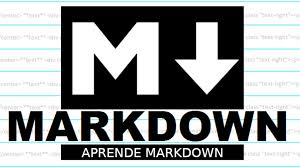

# Reporte 01: MARKDOWN, Git, Github, Hugo y Github Aactions

**Autor:** Daniel Mojica Salgado

**Fceha:** 10 de septiembre de 2025

## ¿Qué es Markdown?

Markdown es un lenguaje de marcado que facilita la aplicación de formato a un texto empleando una serie de caracteres de una forma especial. En principio, fue pensado para elaborar textos cuyo destino iba a ser la web con más rapidez y sencillez que si estuviésemos empleando directamente HTML. Y si bien ese suele ser el mejor uso que podemos darle, también podemos emplearlo para cualquier tipo de texto, independientemente de cual vaya a ser su destino.

### Sintaxis básica

- Encabezados (#, ##, ###)
- Esto es un texto en *italica* (* palabra *)
- Esto es un texto en **negrita** (** palabra **)
- Listas ordenadas y no ordenadas
  - Elemento 1
  - Elemento 2
  
  1. Elemento 1
  1. Elemento 2
  
- Enlaces e imágenes

    [Que es markdown](https://www.genbeta.com/guia-de-inicio/que-es-markdown-para-que-sirve-y-como-usarlo)

    
- Código en línea y bloques de código

    ```python
    Python
    print(Hola Mundo)
    ```

    ```C
    Lenguaje C
    printf("Hola Mundo");
    ```

- Tablas

    |Elemento1|Eleemnto2|Elemento3|
    | - | - | - |
    |python|C|C++|

## ¿Qué es Git y GitHub?

### Git

[Git](https://git-scm.com/) es un sistema de control de versiones distribuido , gratuito y de código abierto, diseñado para gestionar todo, desde proyectos pequeños hasta muy grandes, con velocidad y eficiencia.

#### Comandos esenciales de Git (chuleta)

- "git init", "git status", "git add", "git commit -m"
- "git log --oneline --graph"
- "git branch", "git switch -c", "git merge"
- "git remote add origin", "git push", "git pull", "git clone"

### GitHub

[GitHub](https://github.com/) es una plataforma basada en la nube donde puedes almacenar, compartir y trabajar junto con otros usuarios para escribir código.

Almacenar tu código en un "repositorio" en GitHub te permite lo siguiente:

- Presentar o compartir el trabajo.
- Seguir y administrar los cambios en el código a lo largo del tiempo.
- Dejar que otros usuarios revisen el código y realicen sugerencias para mejorarlo.
- Colaborar en un proyecto compartido, sin preocuparse de que los cambios afectarán al trabajo de los colaboradores antes de que esté listo para integrarlos.

Al cargar archivos en GitHub, los almacenarás en un "repositorio de Git". Esto significa que al realizar cambios (o "confirmaciones") en los archivos de GitHub, Git se iniciará automáticamente para realizar el seguimiento de los cambios y administrarlos.

## ¿Qué es HUGO?

[Hugo](https://gohugo.io/) es un innovador generador de sitios web estáticos que funciona como un framework web de propósito general. A diferencia de los sistemas dinámicos que generan páginas según las solicitudes de los usuarios, Hugo genera páginas cuando se crea o actualiza el contenido. Esto da como resultado sitios web extremadamente rápidos y seguros , que ofrecen una experiencia de visualización óptima para los usuarios y un proceso de escritura optimizado para los autores.

Una característica distintiva de Hugo es su capacidad para crear sitios web sin necesidad de una base de datos ni depender de entornos de ejecución costosos como Ruby, Python o PHP. Esto lo hace ideal para quienes prefieren escribir en editores de texto y programar manualmente sus propios sitios web sin tener que lidiar con configuraciones complejas.

